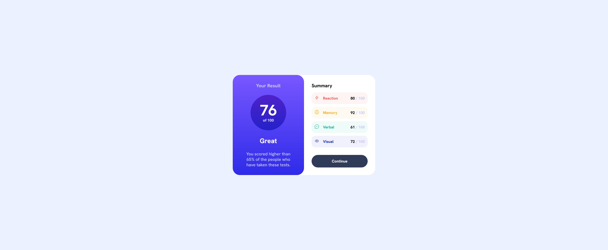
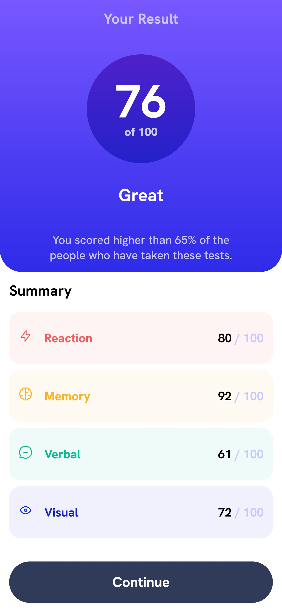

## Table of contents

- [Overview](#overview)
  - [The challenge](#the-challenge)
  - [Screenshot](#screenshot)
  - [Links](#links)
- [My process](#my-process)
  - [Built with](#built-with)
- [Author](#author)

## Overview

### The challenge

Users should be able to:

- View the optimal layout for the interface depending on their device's screen size
- See hover and focus states for all interactive elements on the page

### Screenshots

### Links

- Solution URL: [Add solution URL here](https://your-solution-url.com)
- Live Site URL: [Results Summary Component](https://github.com/Karrroll/Frontend_Mentor_Results_Summary_Component.git)

### Built with

- Flexbox
- CSS Grid

## Author

- Github - [Karrroll](https://github.com/Karrroll)
- Frontend Mentor - [@Karrroll](https://www.frontendmentor.io/profile/Karrroll)

